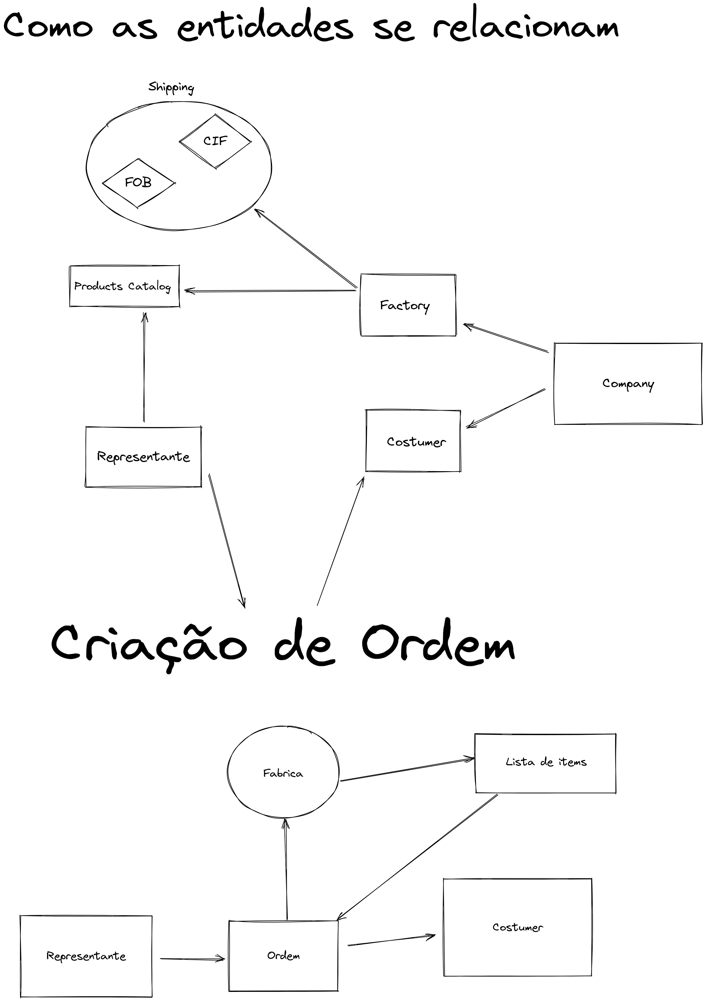

# Shipping Type

## FOB
A sigla FOB (Grátis o Board, em inglês) tem como tradução literal “livre a bordo”. Diferente do CIF, nesta 
opção o frete é responsabilidade do comprador, portanto o próprio cliente se torna responsável pela integridade e 
entrega do produto, devendo assim contratar o transporte.

## CIF
A sigla CIF corresponde a “Custo, Seguro e Frete” (ou Cost, Insurance and Freight, em inglês). Nessa modalidade, 
o fornecedor, ou embarcador, como também é chamado, é o responsável pelos riscos do transporte até a entrega do produto ao comprador.

O frete CIF coloca todos os riscos por conta da empresa fornecedora, visto que o mesmo é pago na origem. 
Ou seja, é o vendedor que deve garantir a segurança de todas as mercadorias, conforme o que foi estabelecido no contrato.
Sendo assim, todos os custos do frete já estão inclusos no produto, como o seu custo de produção, 
os custos relacionados ao transporte e o seguro de transporte da carga até o destino, por exemplo.

# Tax

## IPI 
O IPI (Imposto sobre Produtos Industrializados) é um tributo indireto, ou seja, incide sobre o consumo, 
sendo então repassado no valor da mercadoria, por exemplo, roupas, remédios, alimentos etc. Além disso, 
o IPI incide sobre produtos industrializados, nacionais ou estrangeiros.

# TODO
Estudar sobre a expansão da entidade produtos, catalogando-os.
Fonte de dados:

[BGL Catalog](https://www.bgl.com.br/catalogos-folders.htm)

# Business Questions

1. As transportadoras são fixas por fábrica ou dinâmicas?
2. Os catálogos de produtos de uma fábrica mudam com frequência?
3. Os pagamentos são definidos de qual maneira? Por quem?
4. Quais empresas pagam ou não, impostos. Como o IPI é definido?
5. Como é feito o pedido? Autorizado por alguém? Direto?
6. Em uma ordem, somente uma fábrica pode ser cotada para um único cliente, ou podem existir produtos em uma ordem de mais de uma fábrica.
7. Um catalogo por usuário, e custom products. 

# Dev Questions

1. Um usuário vai ter acesso ao product de outro usuário?

# Tasks

# Ideas

1. O usuário não deve, não deveria, preencher nenhuma informação além daquilo que for extremamente necessário.
2. Nós precisamos fazer o trabalho sujo, inserção de dado, etc.

# Diagrams

